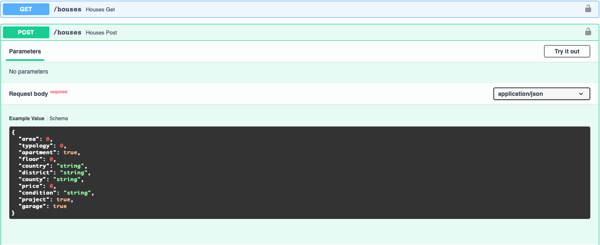

# yapi
YAPI - Yaml API. Just a small project I use to create APIs automatically by specifying the endpoints in a YAML file, in small IoT/automation/DS projects.

The example in [houses.yaml](https://github.com/62random/yapi/blob/main/example/houses.yaml) generates the following API:

